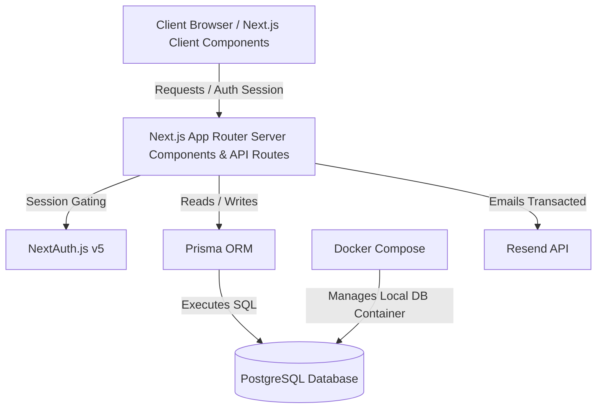

# MLBuilder Architecture Documentation

This document explains the core architectural layout of the MLBuilder fullstack application after the migration from Vite SPA to Next.js App Router.

---

## Technical Stack Overview

---

## 1. Why Next.js (App Router)?
- **Unified Process:** The frontend UI and backend API routes run under a single Next.js Node process. This simplifies local development and production deployments.
- **Server Components by Default:** By default, pages are React Server Components (RSC). This reduces client bundle size and allows direct database access during page renders.
- **Client Components Opt-in:** Interactivity, client hooks, and event handlers use `"use client"` directives.
- **Middlewares:** Provides request-level routing controls, making authentication gating (session redirecting) robust and performant.

---

## 2. Why Prisma + PostgreSQL?
- **Type-Safe ORM:** Prisma generates strong TypeScript types directly from the database schema (`schema.prisma`). It prevents runtime database query bugs.
- **Singleton Client Pattern:** We prevent database connection pool exhaustion in development hot-reloads using a singleton Prisma client in [lib/prisma.ts](file:///d:/Movies/mlbuilder/lib/prisma.ts).
- **PostgreSQL:** A highly scalable, production-grade relational database.

---

## 3. Why NextAuth (Auth.js v5)?
- **Native Next.js Support:** Built specifically to integrate with Next.js middleware, Server Components, and API routes.
- **Credentials & OAuth:** Supports credential email/password login (with custom Zod + bcrypt verification) out of the box, with built-in hooks to attach user metadata to the session.
- **Security:** Standardizes token management, cookie security, CSRF protection, and session lifecycle.

---

## 4. Why Docker Compose?
- **Zero-Install PostgreSQL:** Team members do not need to install Postgres locally on their hosts. Running `npm run db:start` spins up a containerized PostgreSQL instance in the background.
- **Isolated Data:** Container state is persisted via a named volume (`mlbuilder_postgres_data`), separating database storage from application storage.
